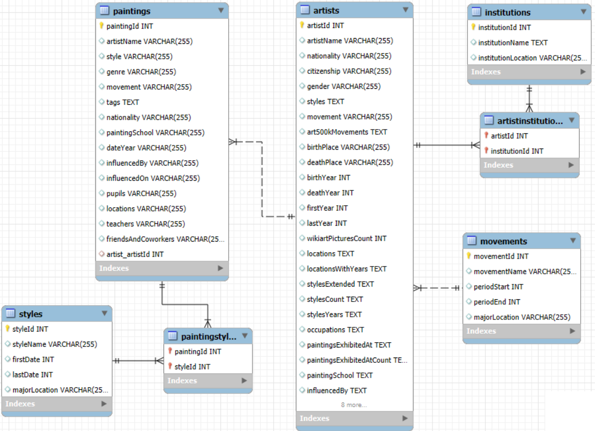
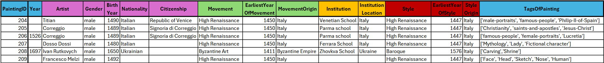

# Painters, Paintings, Institutions and Styles: SQL data warehouse, ETL pipeline and analytics
(This was a project for the Data Engineering 1 course at CEU; project 1.)

## A data warehouse for analyzing paintings and painters

With information (data) about painters and their paintings, institutions and movements, and the styles of paintings, I can ask various questions regarding the relations of these entities:

- What styles are most common per institution?
- Most common movements per style and most common styles per movement (excluding cases when style and movement are the same)?
- Which painters have the most paintings preserved (assuming most paintings of famous painters are stored in the database)?

These are questions that may change over time, e.g. institutions may change their focus and we might have new institutions, painters, or styles as time goes on. We need to prepare a data warehouse for this analysis to be easily run anytime, on updated data.<br>
In order to answer such questions, we need to create and for future purposes maintain a relational database, querying relational information (information based on styles-paintings-painters-movements-institutions relationships). This project is a continuation of my work on creating datasets and tools for art research.

## Technical details

**To run the project, after cloning, in the `operational_layer_data_processing.sql` file change the paths for each imported CSV file!** Unfortunately MySQL doesn't support variables in the `LOAD DATA INFILE` command, nor does it support `LOAD DATA` inside stored procedures, and relative paths are relative to the .exe not the script, so the paths were "hardcoded".<br>
**The painting datasets are large, make sure to have a high enough threshold for MySQL timeouts when loading them! (Can be easily set, 60secs worked well for me.)**

The collected datasets are stored in the following CSV files: `artists.csv` for painters, `paintings_art500k.csv` and `paintings_wikiart.csv` for paintings.<br>
From these, I derived also tables for institutions, movements (one per artist) and styles (of paintings, a painting can have multiple styles even).<br>
To add extra information to the institution, movement and style tables, I added location information from the file `institutions_origins.csv`, `movements_origins.csv` and `styles_origins.csv` files. (These include an instance for each institution/movement/style, and the origin location of it, "predicted" by Generative AI (using Python) to have broader information.)

The files should be run in the following order: **`operational_layer_data_processing.sql`**, **`analytics_table.sql`**, **`pipeline.sql`**, **`data_marts.sql`**.

## The structure of the created database

After importing a table of painters, importing 2 painting datasets and combining them into one table, and deriving tables for institutions, movements and styles from the data of painters and paintings, enriched with external information (of locations), the database took up the following structure:

<div align="center">
    
</div>

Every painter has one movement (which can have multiple painters), and every painting has one painter (who can have multiple paintings).<br>
However, painting-style and painting-institution relations are many-to-many; to deal with this an inbetween table is creating for each of these relations.<br>
All connections allow for null values, i.e. foreign keys can be null. (Can happen that a painting's painter is unknown, and so on.)<br>
The datasets which are used to create the painting table and other tables are not included in the diagram, as they can be dropped after these tables are loaded with data.

## Analytical plan

*What do we have that we can work with?*

The [PainterPalette](https://github.com/me9hanics/PainterPalette) dataset includes plenty information (~30 attributes) of 10000+ painters, in several categories:

- Biography data: Nationality/citizenship, name, birth and death years and places, gender - this is what we will mostly use.
- Artistic style data
- Locations of activity (sometimes with years)
- Occupations (e.g. painter, sculptor, litographer, etc.)
- Affiliations (mostly painting schools)
- Influences: on painters and by painters; pupils and teachers
- Friends, coworkers (very limited data)
- Quantities of paintings, in styles, etc.

For the type of analytics I run, only relying on biography data of painters directly is sufficient, but I used the artists' movement and painting schools to fill up the movement and institution tables.
These have a place of origin, and the movements along with styles have a beginning and end date.

The paintings datasets also include notable information about the artists, but most importantly include stylistic and temporal information, and thematic information (e.g. the painting is a portrait, a landscape, is a religious painting etc.).

To find connections between institutions and styles, or movements and styles, we can aggregate data through paintings, connecting the styles, movements and institutions to the paintings directly or indirectly. It suffices to create an **analytical table** for all sorts of queries, that stores instances of painting-style-painter-institution-movement relations with all relevant columns.<br>
The `analytics_table.sql` file has the implementation of such a table. A sample of it:



Specifically, for viewing the movement-style and institution-style relations, we can create **data marts (views in MySQL)** that store the specific queries for the subset of the data we need for these questions (e.g. movement-style pairs with counts, ordered in decreasing count). Those are implemented in the `data_marts_analytics.sql` file.

The project needs to be designed to handle newly added painting data (to the Paintings table) for analytics. To continuously update our analytical table when a new painting is added, we need to create an **ETL pipeline**. This is done in the `pipeline.sql`, when a new painting is added, on a trigger the ETL pipeline firstly updates the tables of the relational database, and then updates the analytical table. We also trigger on updates of the artist table, updating the movements and artist-institutions tables if needed, but in this case we do not to update the analytical table. (Ideally, for every table update e.g. updating the institutions table, we'd refresh any instance with that institution in the analytics table, but that is out of scope now.)<br>
With the ETL pipeline we keep the analytical table up-to-date.<br>
(Side note: if I were to use Materialized Views instead of simple Views for the data marts, as they are physical copies I would need to update them too, at least periodically.)<br>
Extraction is done by triggering the pipeline when a new painting is added, processing this information and updating the tables, then loading fresh data into the analytical table.

The steps of the ETL pipeline upon painting addition:

- 1. If the artistName is not null, check if the artist exists. If not, update the Artists table.
- 2. Foreign key update (Paintings table)
- 3. Add the styles if needed to the Styles table
- 4. Update the PaintingStyles table
- 5. Add the new instance into the analytical table

The first two steps require updating the table that we trigger on when being updated, and that can only be done with BEFORE triggers (otherwise there would be an infinite loop). The last three steps are done in the AFTER trigger.<br>
The steps of adding a new artist are similar, but there is no 5th step as the analytical table does not change.

## Structure (separate layers) and files

The separate files/layers are as follows, and **should be run in the following order**:

**`operational_layer_data_processing.sql`**: An operational data layer in SQL, designed for MySQL local instances: Importing data of painters and paintings, and creating relations. Firstly, data of painters are loaded into the created table of artists, then the institutions, artist-institutions, movements and styles tables are created with the right constraints. I then create temporary tables for the two datasets of paintings (Art500k and WikiArt). Only then I create the combined table of paintings, with constraints and foreign keys to save time (the paintings table is massive), and I fill it up with the two datasets' instances, dropping the temporary tables afterwards.<br>
As last steps, I fill up columns with the right values: firstly I add instances of movements and styles based on the movements from the painters table and styles from the paintings table. These are stored in the style and movement column, I do not need to take multiple columns for the information, however styles for one instance are separated by commas (e.g. *Expressionism, Pointillism*), therefore I select each value separated by a comma - this can be effectively done by this query:

```SQL
SELECT DISTINCT TRIM(SUBSTRING_INDEX(SUBSTRING_INDEX(style, ',', numbers.n), ',', -1)) AS substring
FROM Paintings
JOIN (SELECT 1 n UNION ALL SELECT 2 UNION ALL SELECT 3) numbers -- Just numbers 1, 2, 3
ON CHAR_LENGTH(style) - CHAR_LENGTH(REPLACE(style, ',', '')) >= numbers.n - 1
```

For each comma (numbered from 1 to 3), the first `substring_index` function cuts out any text after the comma, and the second `substring_index` function cuts out anything up to the previous comma (trim removes redundant spaces). There is no instance with more than 3 styles, so joining with (1,2,3) is enough, this join will include all comma separated styles. I do similarly with the institutions, and for the two inbetween tables of painting-style and painting-institution relations I use the `FIND_IN_SET` function to find pairs of IDs.<br>
Once I have these, I update artist and painting foreign keys, and start filling up the remaining columns of styles, movements and institutions. The first two include a firstDate and lastDate column / periodStart and periodEnd column, which I fill up the earliest date of the style/movement, looking for 4-digit numbers in the painting dates. The location information is then filled from `institutions_origins.csv`, `movements_origins.csv` and `styles_origins.csv` files, with the help of temporary tables.

This results in the diagram seen above.

**`analytics_table.sql`**: The "analytical layer", contains the construction of the denormalized table discussed above using the relational database created prior, called `PaintData`.

Because many paintings do not have a painter (stored in our database), and many painters have no institution, etc. and each (foreign key) relation is allowed to be `Null`, I use left joins for joining tables to create the analytical table. This way all instances of paintings are included.<br>

**`pipeline.sql`**: The "ETL pipeline" layer, contains the creation of triggers for updating the analytical table when a new painting is added, and for updating the movements and artist-institutions tables when a new artist is added. The triggers are created on the `Paintings` and `Artists` tables, respectively. The triggers are implemented as follows:

1. **New painting added to the Paintings table**:
    - **BEFORE INSERT Trigger** (as table modification is only allowed in before triggers):
        1. If the `artistName` is not null, check if the artist exists. If not, update the `Artists` table.
        2. Foreign key update (Paintings table).
    - **AFTER INSERT Trigger**:
        3. Add the styles if needed to the `Styles` table.
        4. Update `PaintingStyles`.
        5. Update the analytical table with the new instance(s).

2. **New painter added to the Artists table**:
    - **BEFORE INSERT Trigger** (as table modification is only allowed in before triggers):
        1. If `movementName` is not null, check if the movement exists. If not, add it to the `Movements` table.
        2. Update the `movementId` foreign key.
    - **AFTER INSERT Trigger**:
        3. If `institutionName` is not null, check if the institution exists. If not, add it to the `Institutions` table.
        4. Update the `ArtistInstitutions` table.
        (No need to update the analytical table as a 5th step, as no painting is added.)

**`data_marts_analytics.sql`**: The "data mart" layer. Building on the analytical table, contains the creation of views for specific queries:

- the most common styles per institution
- the most common movements per style and vice versa, sorted by, the most common styles per movement, etc.
- painters with the most paintings, movements with the least paintings

These are created as views, simulating data marts, and can be updated with new data by running the queries again. Views in MySQL are unmaterialized, which allow for efficiently querying, without duplicating the data, unlike materialized views. (Materialized views are not implemented in this project.)

To simplify some of the analytics, in the analytical table I did not group instances together (e.g. one painting with multiple styles will have an instance for each style, the same for each painter institution), i.e. some paintings have multiple instances, differing in style or artist institutions. Using this is perfect for most of the queries, but for analytics where the number of paintings matter or other cases, I created a view called `GroupedPaintData` that combines instances of paintings with distinct styles and institutions. The institutions and styles, and their locations are concatenated into one string. This view helps in reducing the redundant grouping we'd have to do for many queries if we just use `PaintData`.